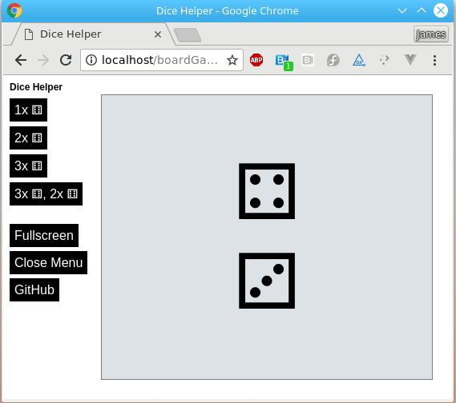
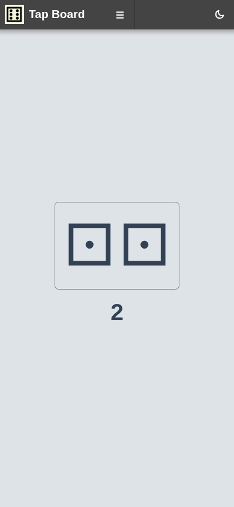
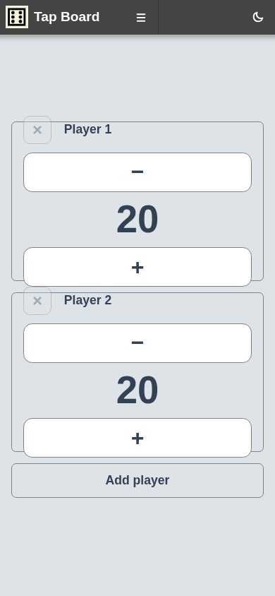
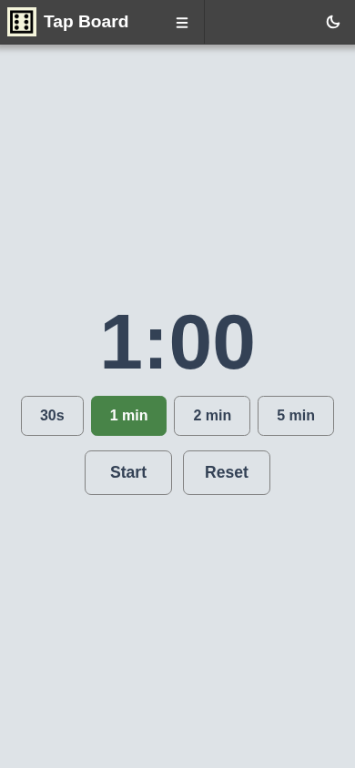
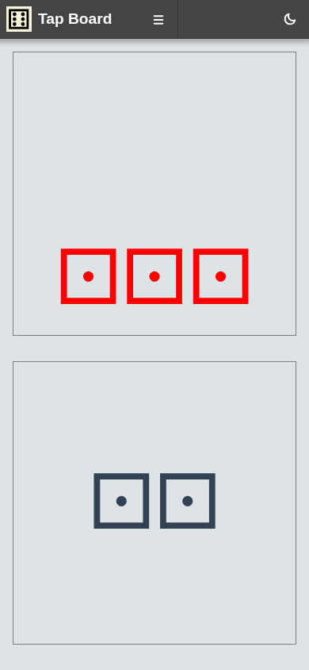

++++

  
  <h1>Tap Board</h1>

  A touch-first web app with simple helpers for board-game players — roll dice, track scores, count life totals, time turns, and more.

++++

Built with Vue 3 and link:https://github.com/jamesread/picocrank[PicoCrank]. The app is fully static; no backend is required.

== Examples

Each helper is a full-screen board with large tap targets, designed for use on a phone or tablet during play.

.Two dice — tap anywhere to roll; the sum is shown below

.Life counter — track life totals for two or more players

.Turn timer — preset countdowns for timed turns

.Three and two — asymmetric dice panels (e.g. 3 red / 2 black)

== Hosted version

There is a hosted, up-to-date version at https://tap-board.5apps.com

== Running with Docker

Pre-built images are published to link:https://github.com/jamesread/tap-board/pkgs/container/tap-board[GitHub Container Registry]:

[source,bash]
----
docker pull ghcr.io/jamesread/tap-board:latest
docker run --rm -p 8080:8080 ghcr.io/jamesread/tap-board:latest
----

Open http://localhost:8080[localhost:8080].

=== Build locally

[source,bash]
----
docker build -t tap-board .
docker run --rm -p 8080:8080 tap-board
----

Or use the Makefile:

[source,bash]
----
make container    # build and run locally
make publish      # build and push to ghcr.io (requires login)
----

== Screenshots

Screenshots are captured with link:https://github.com/jamesread/repo-common[repo-helper] using `screenshots.ini`:

[source,bash]
----
docker run --rm -p 8765:8080 ghcr.io/jamesread/tap-board:latest &
repo-helper screenshot --config screenshots.ini
----
